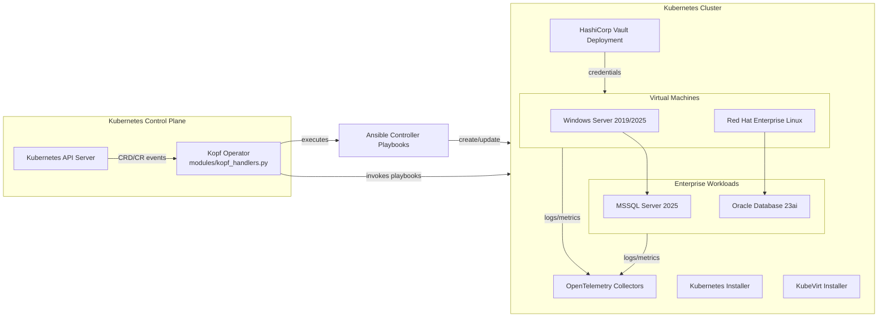
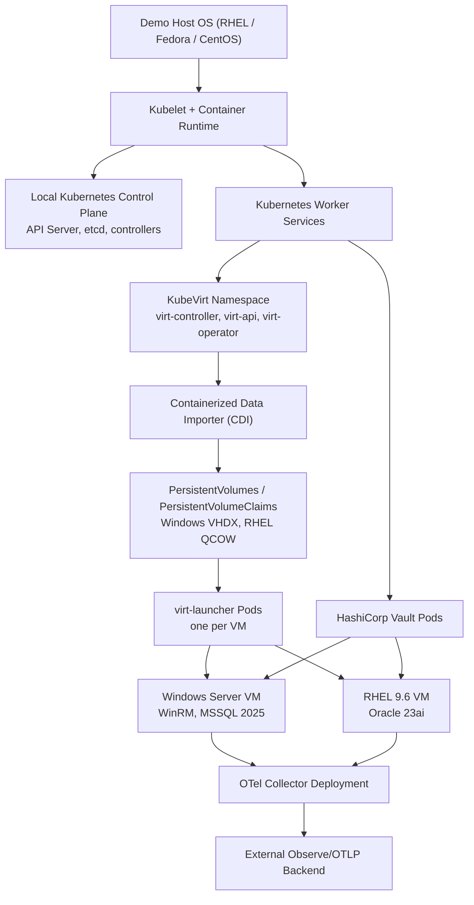
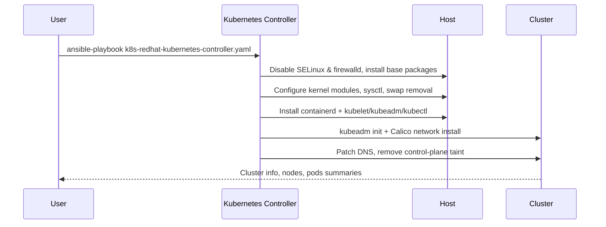
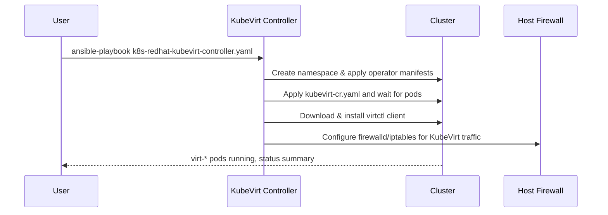
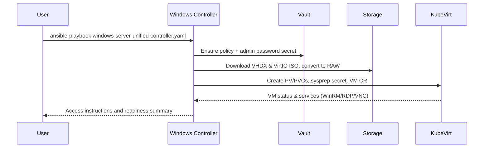
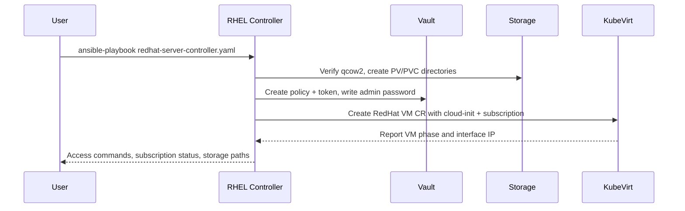
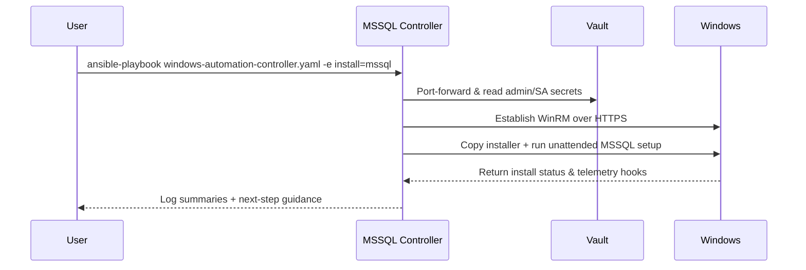
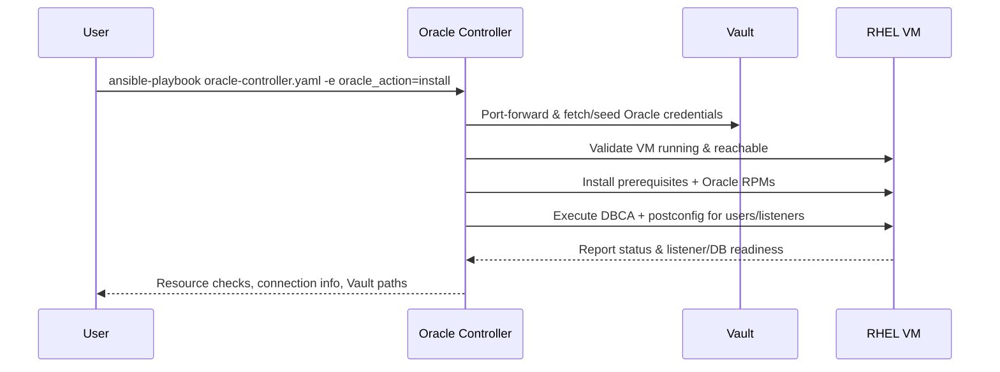

# Kubernetes Installer Platform

End-to-end automation for building a KubeVirt-based virtual infrastructure on top of a Red Hat Kubernetes stack, provisioning enterprise workloads, and wiring telemetry with OpenTelemetry (OTel).

> **Why this project matters**: It showcases a *native* Kubernetes installation method on Red Hat-based hosts, then layers KubeVirt, Windows/RHEL workloads, and telemetry the same way production teams do it—through manifest-driven, intent-based automation. If you want hands-on experience with declarative infrastructure, CRDs, and fully automated workload onboarding, this repo is your sandbox.

## Context at a Glance

This stack marries upstream Kubernetes running natively on Red Hat-compatible hosts with KubeVirt virtualization so you can operate **containers and virtual machines side-by-side**. Core control-plane services, Vault, and telemetry components run as containers, while Windows Server and RHEL guests execute as full VMs managed by KubeVirt. Both surfaces are reconciled through the same declarative manifests—either via Ansible playbooks or Custom Resources handled by the Kopf operator.

| Platform | Control plane & packaging | Container workloads | VM workloads | Automation approach | Licensing posture |
| --- | --- | --- | --- | --- | --- |
| **Kubernetes Installer (this repo)** | Upstream Kubernetes on RHEL/Fedora/CentOS with KubeVirt, CDI, Vault, OTel | Native Kubernetes workloads (operators, collectors, controller pods) | Windows Server 2019/2025, RHEL 9.6 via KubeVirt VMs | Manifest-driven (Ansible playbooks + CRDs/CRs, GitOps-ready) | Community bits + evaluation media (no bundled subscription) |
| **Red Hat OpenShift + OpenShift Virtualization** | Enterprise Kubernetes distribution with operators, integrated virtualization add-on | Full Kubernetes plus Red Hat curated operators | KubeVirt-based VMs with commercial support | OperatorHub, subscription-backed GitOps pipelines | Requires Red Hat subscription |
| **VMware vSphere / VCF + Tanzu** | ESXi hypervisor cluster with vCenter management; Tanzu adds Kubernetes namespaces | Tanzu Kubernetes Grid clusters atop ESXi | Native VMs first-class; containers run in supervisor/TKG clusters | UI-driven workflows, PowerCLI, some YAML for Tanzu | Commercial licensing (CPU core/host) |
| **Proxmox VE** | Debian-based bare-metal virtualization with LXC + QEMU/KVM | LXC containers (not Kubernetes-native) | QEMU/KVM VMs via Proxmox UI/API | Web UI, Terraform/Ansible modules, limited declarative flow | Freemium (enterprise repo subscription optional) |
| **Microsoft Hyper-V** | Windows Server/Hyper-V role or Hyper-V Server standalone | Containers via Windows Server + Docker/AKS-HCI (separate) | Hyper-V VMs (Windows/Linux) | PowerShell, SCVMM, GUI; manifests limited to ARM templates | Commercial (Windows Server licensing) |

### Container vs. VM workloads in this architecture

| Layer | Example components | Runtime |
| --- | --- | --- |
| Kubernetes control plane & operators | API server, etcd, Kopf operator, HashiCorp Vault, OpenTelemetry collector | Containers |
| Virtualized infrastructure | KubeVirt controllers, CDI importer pods | Containers |
| Enterprise workloads | Windows Server guests (backing MSSQL), RHEL guests (backing Oracle) | Virtual machines |

Think of it as building a Red Hat-hosted Kubernetes cloud that speaks the same declarative language for both pods and VMs, giving you a single automation story across infrastructure, OS images, and application payloads.

The project combines two complementary entry points:

1. **Controller playbooks** – stand-alone Ansible playbooks that can be run sequentially or individually.
2. **Kopf operator & TUI** – a Python-based operator entry point (`kopf_opeartor.py`) that ships with an interactive urwid TUI (`modules/tui_interface.py`) and an optional headless `--operator-only` mode. Both paths expose Custom Resources (CRDs/CRs) to drive the same playbooks declaratively.

## 🏗️ High-Level Architecture



## Component Stack

| Layer | Purpose | Key Artifacts |
| --- | --- | --- |
| **Kubernetes foundation** | Bootstraps the Red Hat Kubernetes control plane needed by everything else. | `k8s-redhat-kubernetes-controller.yaml` |
| **Virtualization (KubeVirt)** | Adds KubeVirt to host Windows and RHEL virtual machines inside Kubernetes. | `k8s-redhat-kubevirt-controller.yaml` |
| **Secrets (HashiCorp Vault)** | Provides secret storage for Windows admin passwords, MSSQL secrets, etc. | `hashicorp-vault-service-controller.yaml`, `hashicorp-vault-service/` | 
| **Virtual machine workloads** | Provisions Windows Server (2019/2025) and RHEL 9.6 images via KubeVirt. | `windows-server-controller.yaml`, `windows-server-unified-controller.yaml`, `redhat-server-controller.yaml` |
| **Application workloads** | Layered installs for Microsoft SQL Server 2025 on Windows and Oracle 23ai on RHEL. | `windows-automation-controller.yaml`, `oracle-controller.yaml`, `oracle/` |
| **Telemetry** | Deploys OTel collectors and per-workload pipelines for unified observability. | `otel-controller.yaml`, `otel/` |
| **Operator mode** | Kopf runtime + TUI console that translates CRs into playbook runs for GitOps-style automation. | `kopf_opeartor.py`, `modules/` |

## 🖥️ Standalone Host Layering

The demo environment can run on a single physical or virtual host. The following diagram shows how the stack is assembled from the operating system up to the application telemetry pipelines.



### Storage & VM imaging

* **Containerized Data Importer (CDI)** pulls base images (for example, `win2025server.vhdx`, `rhel-9.6-x86_64-kvm.qcow2`) into `PersistentVolumeClaims`.
* Each VM receives a dedicated PVC mounted into its `virt-launcher` pod.
* Additional `ConfigMap`/`Secret` mounts provide unattended installation scripts and credentials.

### Vault-backed secrets

* Vault runs in the `hashicorp-vault` namespace.
* Windows, MSSQL, and Oracle playbooks request credentials via the Vault HTTP API. Tokens are injected through environment variables or read from token files.
* `Secret` objects created by the playbooks are mounted into pods needing application credentials (for example, OTel collector exporters).

### Observability flow

1. Windows and RHEL VMs expose metrics/logs through sidecar agents installed by the playbooks.
2. The OTel collector consolidates and forwards data to the configured OTLP destination (Observe, Splunk, etc.).
3. MSSQL, Oracle, and Vault pipelines include authentication secrets handled via Vault.

## Deployment Workflow

The typical path from bare cluster to fully instrumented workloads:

1. **Install Red Hat Kubernetes** – provides the control plane where everything runs.
2. **Add KubeVirt** – enables VM orchestration inside the cluster.
3. **Deploy HashiCorp Vault** – secret backend for Windows and database credentials.
4. **Provision VMs** – deploy Windows Server (2019/2025) and RHEL VMs via KubeVirt.
5. **Install application payloads** – MSSQL 2025 atop Windows, Oracle 23ai atop RHEL.
6. **Activate telemetry** – install the OTel collector(s) and pipeline components.

Each step can be executed manually via Ansible or driven declaratively through CRs handled by the Kopf operator.

## Operating Modes

### 1. Running Controller Playbooks Directly

All commands are executed from the repository root (no absolute paths required).

> **Before you begin:** Make sure `ansible-core` and the required collections are installed — see the [Prerequisites](#prerequisites) section above.
>
> ```bash
> sudo dnf install -y ansible-core
> ansible-galaxy collection install -r requirements.yml
> ```

```bash
# 1. Install Kubernetes
ansible-playbook k8s-redhat-kubernetes-controller.yaml -e k8s_action=install

# 2. Install KubeVirt
ansible-playbook k8s-redhat-kubevirt-controller.yaml -e kubevirt_action=install

# 3. Deploy HashiCorp Vault
ansible-playbook hashicorp-vault-service-controller.yaml -e action=install

# 4. Provision Windows Server 2025 VM
ansible-playbook windows-server-unified-controller.yaml -e action=install -e windows_version=2025

# 5. Provision RHEL VM (example)
ansible-playbook redhat-server-controller.yaml -e action=install

# 6. Install MSSQL 2025 on the Windows VM
ansible-playbook windows-automation-controller.yaml -e install=mssql

# 7. Install Oracle 23ai on the RHEL VM
ansible-playbook oracle-controller.yaml -e action=install

# 8. Deploy OTel stack (collector + pipelines)
ansible-playbook otel-controller.yaml -e action=install -e otel_install_components='["collector","windows","redhat","vault","oracle","mssql"]'
```

#### Quickstart: Kubernetes + KubeVirt + Windows VM

The following Bash session demonstrates a minimal deployment path from an empty demo host to a running Windows Server guest. Run the commands from the repository root.

```bash
# Install the base Red Hat Kubernetes control plane
ansible-playbook k8s-redhat-kubernetes-controller.yaml \
    -e k8s_action=install \
    -e k8s_hostname="demo-control-plane.local"

# Layer on the KubeVirt virtualization stack
ansible-playbook k8s-redhat-kubevirt-controller.yaml \
    -e kubevirt_action=install \
    -e kubevirt_namespace=kubevirt

# (Optional but recommended) Deploy HashiCorp Vault for secret management
ansible-playbook hashicorp-vault-service-controller.yaml \
    -e action=install \
    -e vault_namespace=hashicorp-vault

# Provision a Windows Server 2025 VM image via KubeVirt
ansible-playbook windows-server-unified-controller.yaml \
    -e action=install \
    -e windows_version=2025 \
    -e vm_name=windows2025 \
    -e kubevirt_namespace=default \
    -e windows_admin_password="Str0ngP@ss!" \
    -e windows_admin_password_vault_path="secret/data/windows-server-2025/admin"

# Verify the VM is up (status play)
ansible-playbook windows-server-unified-controller.yaml \
    -e action=status \
    -e windows_version=2025 \
    -e vm_name=windows2025
```

Once the Windows VM reports `phase=Ready`, you can continue with workload installs (for example MSSQL) or enable telemetry using the controllers described below.

**Tips**

* Override any default value with `-e key=value` (for example, `-e windows_admin_password=StrongP@ss1`).
* Provide unique OTLP tokens per pipeline (`windows_otel_token`, `redhat_otel_token`, etc.).
* Vault integration expects either `vault_token` or a readable token file; see the playbook docstrings for details.

#### Installer Highlights

* **Red Hat Server automation** – the `redhat-server-controller.yaml` pipeline walks a RHEL image from raw media to a subscribed, Vault-backed guest. When you supply `subscription_username` / `subscription_password` (either via extra vars or environment), the playbook registers the VM with `subscription-manager`, auto-attaches the right repositories, enables the AppStream/BaseOS channels, and seeds Vault with the admin password policy. You can even flip on EFI boot, auto-convert QCOW ➜ RAW, and let it mint local PV/PVC storage on the fly.
* **Windows zero-touch build** – the unified Windows controller layers Autounattend + sysprep secrets, downloads (or reuses) the Microsoft evaluation VHDX, stages VirtIO media, and injects a PowerShell driver bundle so pnputil/DISM bring every virtio driver online—including NetKVM, storage, RNG, ballooning, GPU, serial, and WinRM HTTPS. When the VM boots it already has WinRM/RDP enabled, Vault-backed credentials, firewall holes opened, and NodePort/ClusterIP services created—so you get an on-prem “cloud-like” Windows experience without ever opening the console.

### 2. Kopf Operator & TUI Console

`kopf_opeartor.py` is the unified entry point for the urwid-based console and the Kopf operator workers that reconcile CRDs/CRs.


#### Launch the interactive console

```bash
python kopf_opeartor.py
```

Running the script without flags loads the kubeconfig, spawns the Kopf operator in a background thread, and opens the full-screen TUI defined in `modules/tui_interface.py`. Key capabilities include:

* **Interactive CRD/CR lifecycle** – dedicated menus (*Apply CRDs*, *Apply CRs*, *Delete CR*, *Delete CRD*) that walk you through every YAML in `manifest-controller/` without typing commands.
* **Consolidated status board** – live view of deployed CRDs/CRs, grouped by service domain (VMs, MSSQL, OTel) with health indicators.
* **Streaming logs** – the TUI tails the shared `log_queue`, so operator/TUI messages remain visible without switching terminals.
* **Service actions** – integrate with `modules/service_managers.py` to trigger playbook workflows directly from the console.

Use this mode when you want an operator cockpit on the demo host or when bootstrapping interactively—no manual `kubectl` required.

#### Headless `--operator-only` mode

```bash
python kopf_opeartor.py --operator-only
```

The `--operator-only` switch starts the same Kopf reconcilers but skips the TUI entirely. Console logging stays enabled (see `modules/utils/logging_config.py`), making it ideal for:

* Running in CI/CD pipelines or GitOps controllers.
* Packaging the operator into a container image.
* Remote environments where an ncurses/urwid UI is not available.

In this mode you must manage CRDs/CRs yourself from the `manifest-controller/` directory:

```bash
# Apply (create/update) a definition
kubectl apply -f manifest-controller/windows-server-vm-crd.yaml
kubectl apply -f manifest-controller/windows-server-vm-cr.yaml

# Delete a resource/definition
kubectl delete -f manifest-controller/windows-server-vm-cr.yaml
kubectl delete -f manifest-controller/windows-server-vm-crd.yaml
```

Repeat for the other manifests (`mssqlserver-crd.yaml`, `mssqlserver-cr.yaml`, `otel-telemetry-crd.yaml`, etc.) as needed.

#### Declarative GitOps workflow (CRDs/CRs)

Whether you use the interactive console or headless mode, the overall workflow is the same:

1. **Deploy CRDs** – files live in `manifest-controller/` (for example `mssqlserver-crd.yaml`, `windows-server-vm-crd.yaml`, `otel-telemetry-crd.yaml`). The TUI exposes an *Apply CRDs* menu, or run `kubectl apply -f …` manually.
2. **Start the operator** – launch `kopf_opeartor.py` (with or without `--operator-only`). The handler implementations reside in `modules/kopf_handlers.py`.
3. **Apply CRs** – use the TUI’s *Apply CRs* menu or `kubectl apply` to submit manifests such as `windows-server-vm-cr.yaml`, `mssqlserver-cr.yaml`, `otel-telemetry-cr.yaml`.

Example: install full telemetry via CRs using CLI commands

```bash
kubectl apply -f manifest-controller/windows-server-vm-crd.yaml
kubectl apply -f manifest-controller/mssqlserver-crd.yaml
kubectl apply -f manifest-controller/otel-telemetry-crd.yaml

kubectl apply -f manifest-controller/windows-server-vm-cr.yaml
kubectl apply -f manifest-controller/mssqlserver-cr.yaml
kubectl apply -f manifest-controller/otel-telemetry-cr.yaml
```

Once running, the operator:

* Watches for resource events.
* Resolves variables via `modules/utils/var_helpers.py` (CLI overrides, environment variables, CR spec, defaults).
* Invokes the same Ansible playbooks used in manual mode.
* Updates status fields (`phase`, `message`, `conditions`) to reflect progress.

### Kopf vs. Playbook quick comparison

| Capability | Playbook mode | Operator mode |
| --- | --- | --- |
| Execution style | Imperative, ad-hoc | Declarative, event-driven |
| GitOps friendliness | Manual sequencing | CR commits trigger lifecycle |
| Status tracking | CLI output/logs | CR `.status` fields, events |
| Extensibility | Edit playbooks | Extend handlers (`modules/`) |

## Telemetry & Observability

The OTel controller orchestrates:

* Core collector deployment (`otel/otel-collector-install.yaml`).
* Optional pipelines (Vault, Windows, RHEL, Oracle, MSSQL) driven by component selection.
* Vault integration for secrets (e.g., retrieving Windows admin passwords securely).

Provide per-component endpoints/tokens when installing:

```bash
ansible-playbook otel-controller.yaml \
  -e action=install \
  -e component="collector,windows,mssql" \
  -e windows_otel_endpoint="https://telemetry.example.com/v2/otel" \
  -e windows_otel_token="WINDOWS_TOKEN" \
  -e mssql_otel_endpoint="https://telemetry.example.com/v2/otel" \
  -e mssql_otel_token="MSSQL_TOKEN"
```

Use the same keys when defining the `OTelTelemetry` CR; the handler automatically respects environment-variable overrides for safe secret injection.

## Custom Resources & Controllers

The Kopf operator translates Kubernetes Custom Resources into playbook executions. The repository includes both the CRD definitions and sample CRs. The following tables summarize the resources.

### Custom Resource Definitions (CRDs)

| CRD file | Resource Kind | Purpose |
| --- | --- | --- |
| `manifest-controller/windows-server-vm-crd.yaml` | `WindowsServerVM` | Describes Windows VM lifecycle (install/uninstall/status) on KubeVirt. |
| `manifest-controller/redhatvm-crd.yaml` | `RedHatVM` | (Optional) Tracks Red Hat VM provisioning tasks. |
| `manifest-controller/mssqlserver-crd.yaml` | `MSSQLServer` | Automates MSSQL Server install on a target Windows VM. |
| `manifest-controller/oracle-db-crd.yaml` | `OracleDB` | Automates Oracle Database 23ai deployment on a RHEL VM. |
| `manifest-controller/otel-telemetry-crd.yaml` | `OTelTelemetry` | Declarative definition of telemetry components and destinations. |
| `manifest-controller/win2025-admin-policy.hcl` | (Vault policy) | Example policy for Vault integration used by playbooks. |

### Sample Custom Resources (CRs)

| CR file | Kind | Highlights |
| --- | --- | --- |
| `manifest-controller/windows-server-vm-cr.yaml` | `WindowsServerVM` | Specifies VM name, namespace, storage defaults, Vault secret path for admin password. |
| `manifest-controller/rhel9-redhatvm-cr.yaml` | `RedHatVM` | Example RHEL VM declaration pointing to the QCOW2 disk. |
| `manifest-controller/mssqlserver-cr.yaml` | `MSSQLServer` | Configures MSSQL install (installer paths, credential vault paths). |
| `manifest-controller/oracle-db-cr.yaml` | `OracleDB` | Declares Oracle VM target, listener port, passwords, and metrics settings. |
| `manifest-controller/otel-telemetry-cr.yaml` | `OTelTelemetry` | Enables collector + component pipelines and sets OTLP endpoints/tokens. |

When these CRs are applied:

1. Kopf watches for create/update/delete events.
2. Handlers in `modules/kopf_handlers.py` resolve desired state.
3. Corresponding playbooks run with merged variables (env overrides > CR spec > defaults).
4. Status updates are written back to the CR `.status` fields for visibility.

## HashiCorp Vault Integration

* **Install** via `hashicorp-vault-service-controller.yaml`.
* Vault secrets store Windows admin passwords (`secret/data/windows-server-2025/admin` by default) and database credentials.
* Playbooks look for `vault_token` or `VAULT_TOKEN` env vars, falling back to `/root/.vault-token` if present.
* Kopf handlers avoid passing empty strings to Ansible, so Vault defaults remain effective.

## Repository Layout (highlights)

```
├── kubernetes/                 # Kubernetes lifecycle task files
├── kubevirt/                   # KubeVirt lifecycle task files
├── hashicorp-vault-service/    # Vault deployment manifests
├── windows-server/             # Windows VM task includes
├── redhat-server/              # Red Hat VM task includes
├── oracle/                     # Oracle DB install/status/uninstall
├── otel/                       # OTel collector + component pipelines
├── manifest-controller/        # CRD/CR examples for Kopf mode
├── modules/                    # Python helpers for Kopf operator
├── windows-automation-controller.yaml   # MSSQL 2025 automation
├── oracle-controller.yaml               # Oracle 23ai automation
├── otel-controller.yaml                  # OTel deployment controller
├── kopf_opeartor.py                      # Operator/TUI entry point
└── requirements.txt                      # Python dependencies for Kopf mode
```

## Prerequisites

* Control host with Ansible 2.14+ and Python 3.9+.
* Access to a Red Hat-compatible Kubernetes cluster (for example, OpenShift or ROSA) with cluster-admin privileges.
* Red Hat / Trial Microsoft / Oracle Developer / Trial licensing or evaluation media.
* Optional: Telemetry/OTel backend credentials for telemetry ingestion.

### Installing prerequisites (first-time setup)

Before running any playbook, ensure `ansible-core` and the required Ansible collections and Python packages are installed on the control host:

```bash
# 1. Install ansible-core (Fedora / RHEL / CentOS)
sudo dnf install -y ansible-core

# 2. Install required Ansible Galaxy collections
ansible-galaxy collection install -r requirements.yml

# 3. (Optional) Install Python operator dependencies
pip install -r requirements.txt
```

> **Note:** `requirements.yml` declares `ansible.posix` (needed for SELinux management in the Kubernetes playbook). `requirements.txt` lists Python packages needed for the Kopf operator and TUI.

## Operational Guidelines

1. **Plan capacity:** The Windows and Oracle workloads require substantial CPU/RAM. Ensure KubeVirt nodes can host them concurrently.
2. **Network access:** Windows and RHEL guests may require outbound internet for package downloads unless you pre-stage media.
3. **Credential storage:** Use Vault for long-lived secrets. The playbooks can also consume environment variables for overrides during CI/CD runs.
4. **Immutability:** Treat CR manifests as the source of truth. Changes to spec fields trigger reconcilers that make the cluster match the desired state.

## Troubleshooting

| Symptom | Common Cause | Remedy |
| --- | --- | --- |
| Kopf reports *unresolved resources* | CRDs not applied before operator start | Apply CRDs from `manifest-controller/` prior to launching Kopf |
| Windows VM fails to retrieve password | Missing Vault token or incorrect secret field | Supply `vault_token` / `VAULT_TOKEN`, or ensure the secret path contains the `password` key |
| MSSQL/Oracle installers hang on WinRM/SSH | VM not ready or credentials incorrect | Check VM status via `virtctl console` / `kubectl get vmi`, review playbook logs |
| OTel components complain about duplicate tokens | Shared OTLP token across pipelines | Provide unique `*_otel_token` values per pipeline |

## Extending the Platform

* Add new workloads by creating an Ansible role/playbook and wiring it into a new Kopf handler + CRD.
* Use `modules/service_managers.py` as a template for orchestrating complex services.
* For additional telemetry pipelines, extend `otel/` with new includes and adjust `_build_oteltelemetry_playbook`.

## Playbook Deep Dives

### Kubernetes Control Plane Installer (Red Hat)

#### Key capabilities

* Disabling swap/SELinux, installing baseline tooling, and configuring kernel modules for CNI traffic.
* Bootstraps containerd with `SystemdCgroup` enabled and installs `kubeadm`, `kubelet`, and `kubectl` from the modern `pkgs.k8s.io` repository.
* Uses `kubeadm init` with a Calico pod network, rewires CoreDNS and kubelet DNS settings, then untaints the control-plane node for single-node labs.
* Emits a full readiness check (cluster-info, nodes, pods) so you know when the control plane is stable.



### KubeVirt & CDI Stack

#### Key capabilities

* Validates that kubelet/containerd are running before touching the virtualization stack.
* Deploys the upstream KubeVirt operator + CR and waits for virt-api, virt-controller, and virt-handler pods to go `Running`.
* Installs the matching `virtctl` client, provisions RBAC for console/VNC access, and opens required firewall/iptables rules when `firewalld` is active.
* Reports installation health and next steps (virtctl, pod checks) once KubeVirt is stitched into the cluster.



### Windows Server Unified Controller

#### Key capabilities

* Seeds Vault with admin credentials, pulls or downloads the Windows evaluation VHDX, and stages VirtIO ISO + sysprep assets.
* Converts VHDX to RAW, creates local PVs/PVCs, and builds a `VirtualMachine` spec with Autounattend, VirtIO driver automation, WinRM/RDP exposure, and optional SecureBoot toggles.
* Provisions NodePort/ClusterIP services (VNC, WinRM, RDP) plus sysprep secrets so the VM boots fully configured and ready for automation.
* Provides post-install guidance (port-forward helpers, Vault retrieval commands) to streamline zero-touch onboarding.



### Red Hat Enterprise Linux VM Controller

#### Key capabilities

* Validates qcow2 media, optionally self-downloads it, and converts to RAW while resizing to the requested system disk size.
* Registers the guest with Red Hat Subscription Manager (username/password or Vault), enables BaseOS/AppStream repos, and manages Vault policies/tokens for admin credentials.
* Creates localized PV/PVC storage, binds them to the node via hostPath, and configures cloud-init to prep SSH users, passwords, and subscription commands.
* Exposes rich troubleshooting output (Vault state, storage paths, VNC/console commands, VM IP discovery) once the VM transitions to `Running`.



### MSSQL Automation Controller (Windows)

#### Key capabilities

* Port-forwards Vault and WinRM HTTPS, pulling admin/SA credentials securely before orchestrating any remote tasks.
* Verifies WinRM bindings, seeds required directories, and uploads the MSSQL installer and auxiliary scripts to the Windows guest.
* Executes unattended SQL Server setup, configures services/firewall, and optionally wires OpenTelemetry exporters based on `otel_config` selections.
* Provides detailed diagnostics (WinRM tests, service discovery, install logs) to simplify troubleshooting from the Ansible console.



### Oracle Database Controller (RHEL)

#### Key capabilities

* Retrieves or seeds Oracle admin credentials in Vault, then validates the target KubeVirt VM is reachable over SSH.
* Ensures OS prerequisites (groups, packages, directories) are in place, handles Oracle RPM/preinstall checks, and tunes resources for 23ai Free.
* Runs DBCA automation against the VM, creates listeners/PDBs, and configures application users with the requested grants.
* Publishes rich status output covering disk/RAM checks, install verification, and Vault integration so you can confidently hand the VM to application teams.



---

This README provides the architecture, operating modes, and practical workflows needed to run the **kubernetes-installer** project on any filesystem path. Clone the repository, run playbooks directly, or let the Kopf operator reconcile CRs—the choice depends on your automation strategy.
