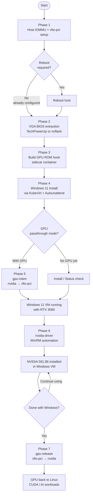
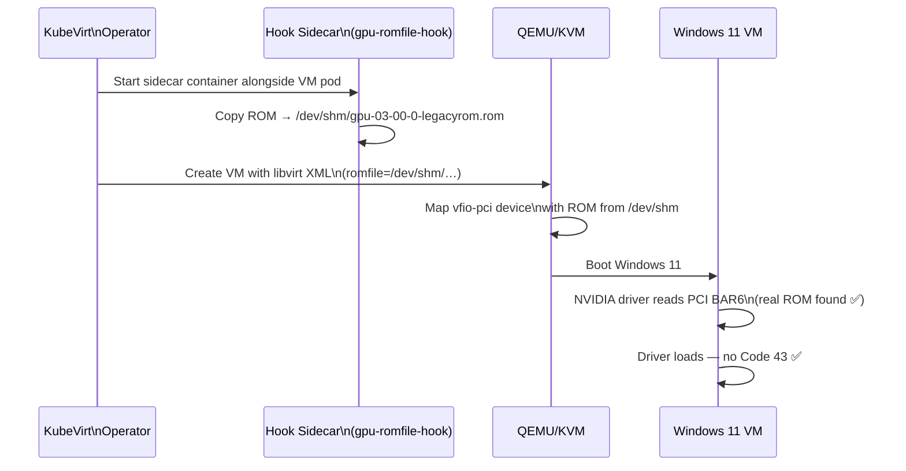
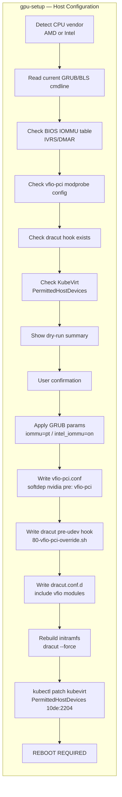
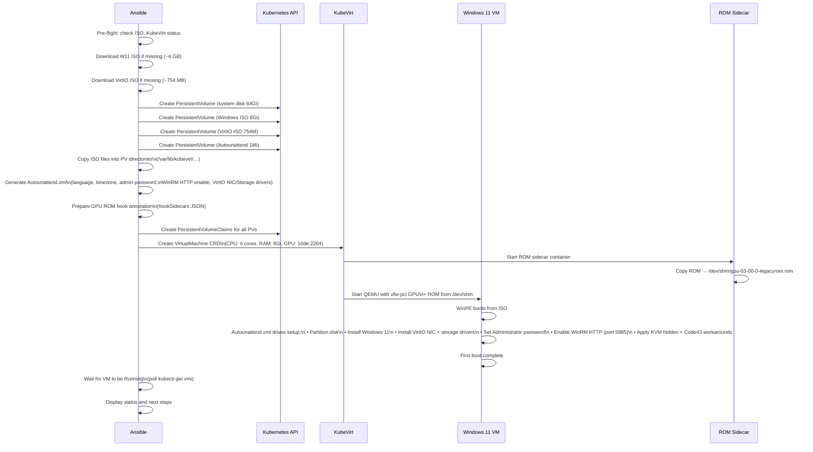
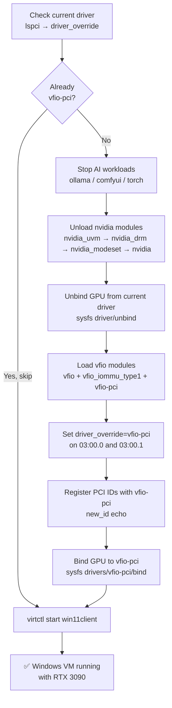
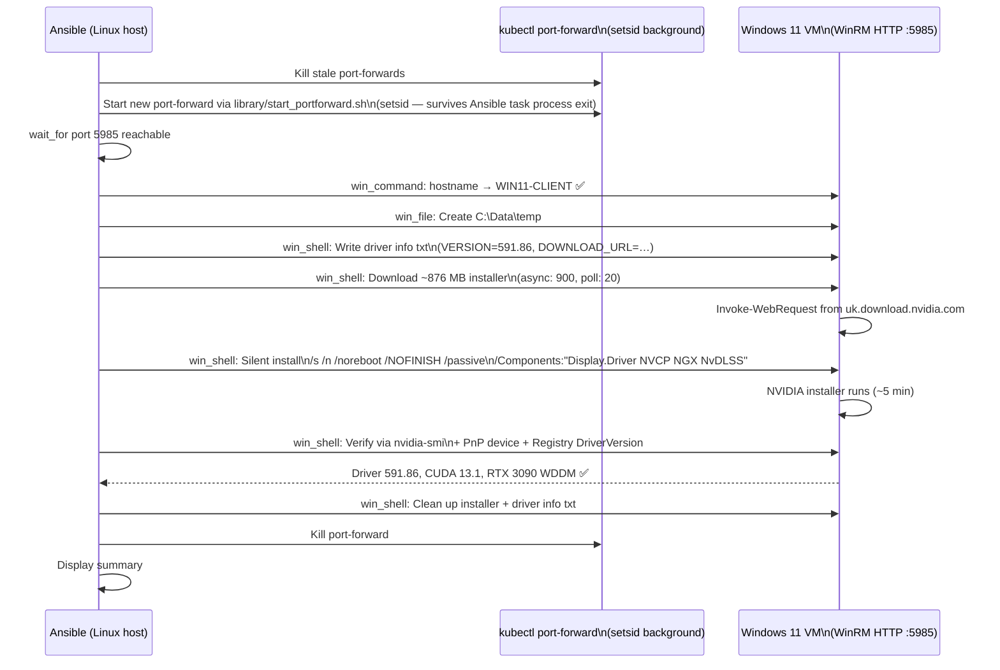
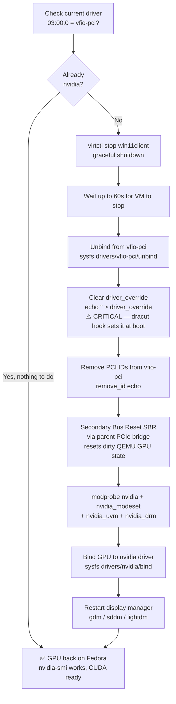

# Windows 11 Client — KubeVirt GPU Passthrough Documentation

End-to-end guide for running a Windows 11 VM under Kubernetes/KubeVirt with a dedicated NVIDIA GPU passed through via VFIO-PCI, including automated NVIDIA driver installation over WinRM.

---

## Table of Contents

1. [Architecture Overview](#architecture-overview)
2. [Prerequisites](#prerequisites)
3. [Full End-to-End Flow](#full-end-to-end-flow)
4. [Phase 0 — Concepts: IOMMU & PCIe Passthrough](#phase-0--concepts-iommu--pcie-passthrough)
5. [Phase 1 — Host Setup: IOMMU + vfio-pci](#phase-1--host-setup-iommu--vfio-pci)
6. [Phase 2 — VGA BIOS Extraction (TechPowerUp)](#phase-2--vga-bios-extraction-techpowerup)
7. [Phase 3 — Build the GPU ROM Hook Sidecar](#phase-3--build-the-gpu-rom-hook-sidecar)
8. [Phase 4 — Windows 11 Installation](#phase-4--windows-11-installation)
9. [Phase 5 — Claim GPU for Windows VM](#phase-5--claim-gpu-for-windows-vm)
10. [Phase 6 — NVIDIA Driver Installation (WinRM)](#phase-6--nvidia-driver-installation-winrm)
11. [Phase 7 — Release GPU Back to Linux](#phase-7--release-gpu-back-to-linux)
12. [Updating the NVIDIA Driver](#updating-the-nvidia-driver)
13. [Video Streaming — Sunshine/Moonlight over Bridge Network](#video-streaming--sunshinemoonlight-over-bridge-network)
14. [Under the Hood — KubeVirt IS QEMU](#under-the-hood--kubevirt-is-qemu)
15. [Troubleshooting](#troubleshooting)
16. [File Reference](#file-reference)

---

## Architecture Overview

```
┌─────────────────────────────────────────────────────────────────┐
│  Kubernetes Node (Fedora Linux)                                  │
│                                                                  │
│  ┌──────────────────────┐   ┌──────────────────────────────┐   │
│  │  Fedora Host / CUDA  │   │  KubeVirt Windows 11 VM      │   │
│  │  (ollama, ComfyUI …) │   │  (WIN11-CLIENT)               │   │
│  │                      │   │                               │   │
│  │  GPU @ 0a:00.0       │   │  GPU @ 03:00.0  ←  vfio-pci │   │
│  │  driver: nvidia      │   │  driver: NVIDIA 591.86        │   │
│  └──────────────────────┘   └──────────────┬────────────────┘   │
│                                             │                    │
│  ┌──────────────────────────────────────────▼────────────────┐  │
│  │  KubeVirt Operator                                         │  │
│  │  • VirtualMachine CRD                                      │  │
│  │  • PermittedHostDevices (10de:2204)                        │  │
│  │  • GPU ROM Hook Sidecar (localhost/gpu-romfile-hook:latest) │  │
│  └────────────────────────────────────────────────────────────┘  │
│                                                                  │
│  PCIe Slot 03:00.0  →  IOMMU Group → vfio-pci driver           │
│  PCIe Slot 0a:00.0  →  nvidia driver (always on for Linux)      │
└─────────────────────────────────────────────────────────────────┘
```

**Key design decisions:**
- **Dual-GPU safe**: Only the RTX 3090 at `03:00.0` is passed to Windows. The second GPU at `0a:00.0` remains on `nvidia` for Linux AI workloads at all times.
- **No-reboot GPU switching**: `gpu-claim` and `gpu-release` dynamically rebind drivers at runtime using `driver_override` + `sysfs bind/unbind`.
- **VGA BIOS ROM provisioning**: A KubeVirt hook sidecar bakes the GPU ROM into a container image and copies it to `/dev/shm` at VM startup — ensures the NVIDIA driver finds valid firmware during initialisation, resolving Code 43.
- **WinRM automation**: Post-install tasks (driver install, configuration) run over WinRM HTTP on port 5985 via `kubectl port-forward`, managed by a persistent `setsid` background process.

---

## Prerequisites

| Requirement | Notes |
|-------------|-------|
| Kubernetes cluster | Single-node or multi-node, Fedora recommended |
| KubeVirt installed | `ansible-playbook k8s-redhat-kubevirt-controller.yaml -e action=install` |
| IOMMU enabled in BIOS | AMD: CBS → NBIO → IOMMU = Enabled. Intel: VT-d. |
| Two GPUs (display outputs) | **Required** — one GPU must always drive the Linux host display/CUDA while the other is passed to the Windows VM. Supported configurations: **(a)** two discrete NVIDIA GPUs (this guide's primary target), **(b)** one CPU-integrated GPU (Intel/AMD iGPU) for Linux display + one discrete NVIDIA GPU for passthrough. AMD discrete GPUs can also be passed through but VBIOS ROM handling and driver workarounds differ — this guide covers NVIDIA passthrough only. |
| virtctl installed | Required for VM start/stop/VNC access |
| ansible-collection `kubernetes.core` | `ansible-galaxy install -r requirements.yml` |
| `virtio-win.iso` | Downloaded automatically during install |
| Windows 11 ISO | Downloaded automatically during install |

---

## Full End-to-End Flow



---

## Phase 0 — Concepts: IOMMU & PCIe Passthrough

### What is IOMMU?

The **Input-Output Memory Management Unit** (IOMMU) is a hardware feature (AMD-Vi / Intel VT-d) that allows the OS to isolate PCIe devices into protected memory regions called **IOMMU groups**. When enabled:

- Each IOMMU group is an isolation boundary — devices within the same group must all be passed to the VM together, or none at all.
- The guest VM gets direct memory-mapped access to the device (DMA), so performance is near-native.
- The host OS cannot touch the device while the guest holds it.

### VFIO-PCI

`vfio-pci` is a Linux kernel driver that:
1. Takes ownership of a PCIe device away from its normal driver (e.g. `nvidia`).
2. Exposes it to userspace (QEMU/KVM) via `/dev/vfio/<group>`.
3. Enforces DMA isolation via the IOMMU so the VM cannot access other memory regions.

### Resolving Code 43 in Passthrough

The NVIDIA GeForce Windows driver validates its execution environment during initialisation. In a KVM-based VM, the driver may report **Error Code 43** if the CPUID responses indicate a hypervisor, or if the GPU firmware ROM is not accessible via PCI BAR6. In a VFIO passthrough configuration the VM has exclusive, unshared access to the physical GPU — the same hardware isolation as bare metal. Two configuration settings align the VM's reported environment with this hardware-exclusive state:

1. **Correct execution environment** — `kvm.hidden: true` in the VM spec adjusts CPUID responses to reflect the VM's dedicated hardware access model, matching the actual passthrough topology.
2. **VGA BIOS ROM provisioning** — The NVIDIA driver reads the GPU firmware ROM from PCI BAR6. In passthrough, this read sometimes fails because the host consumed the ROM during its own POST. Providing the correct ROM via a hook sidecar ensures the driver finds valid firmware.

### KubeVirt Hook Sidecar

KubeVirt supports **hook sidecars**: small containers that run alongside a VM pod and can modify the VM's libvirt XML definition before the VM starts. The GPU ROM hook:

1. Copies the GPU ROM file to `/dev/shm/` (shared memory, visible to the QEMU process).
2. The main QEMU process reads `romfile=/dev/shm/gpu-03-00-0-legacyrom.rom` from the XML.
3. The ROM is injected into the VM's PCIe configuration space before the Windows driver initializes.



---

## Phase 1 — Host Setup: IOMMU + vfio-pci

This is a **one-time operation** per host. It modifies kernel boot parameters and initramfs, requiring a reboot.

```bash
# Dry-run — shows planned changes without applying:
ansible-playbook windows-client-controller.yaml -e action=gpu-setup

# Apply changes (interactive confirmation):
ansible-playbook windows-client-controller.yaml -e action=gpu-setup

# Skip confirmation prompt:
ansible-playbook windows-client-controller.yaml -e action=gpu-setup -e gpu_confirm=yes
```

### What the playbook does



### Slot-specific binding (dual-GPU safe)

The dracut pre-udev hook `/usr/lib/dracut/hooks/pre-udev/80-vfio-pci-override.sh` targets **only** `0000:03:00.0` and `0000:03:00.1`. It sets `driver_override=vfio-pci` on those slots before `udev` runs, so:

- GPU at `03:00.0` → bound to `vfio-pci` at boot (for Windows VM passthrough)
- GPU at `0a:00.0` → bound to `nvidia` at boot (stays for Linux/CUDA)

No `ids=` parameter is used in `modprobe.d` — this is intentional, since `ids=` would claim **all** matching GPUs.

### Verify after reboot

```bash
# Both IOMMU groups should exist and contain many devices:
ls /sys/kernel/iommu_groups/ | wc -l

# GPU at 03:00.0 should be vfio-pci:
lspci -k -s 0000:03:00.0    # Kernel driver in use: vfio-pci

# GPU at 0a:00.0 should still be nvidia:
lspci -k -s 0000:0a:00.0    # Kernel driver in use: nvidia

# AMD IOMMU active:
dmesg | grep AMD-Vi
```

---

## Phase 2 — VGA BIOS Extraction (TechPowerUp)

The GPU ROM file must be provided to the VM for correct NVIDIA driver initialisation. You have two options:

### Option A — TechPowerUp VGA BIOS Collection (recommended, no GPU access needed)

TechPowerUp maintains the world's largest community-sourced GPU BIOS database at:

**https://www.techpowerup.com/vgabios/**

1. Go to https://www.techpowerup.com/vgabios/
2. Set **GPU** = `GeForce RTX 3090` (or your card model)
3. Filter by **Vendor**, **Memory**, and **Video BIOS Version** to match your card exactly
4. Download the `.rom` file
5. Verify the ROM matches your GPU:

```bash
# Check your GPU's BIOS version before downloading:
nvidia-smi --query-gpu=vbios_version --format=csv,noheader

# After download, verify the file is a valid PCI ROM:
file your-gpu.rom
# Expected: "xxxx: PCI ROM: ...NVIDIA Video BIOS..."

# Copy to the expected location:
sudo cp your-gpu.rom /var/lib/kubevirt/gpu-03-00-0-legacyrom.rom
sudo chown root:root /var/lib/kubevirt/gpu-03-00-0-legacyrom.rom
```

> **Tip:** Search TechPowerUp with your card's exact SubVendor ID and SubDevice ID from `lspci -v -s 03:00.0` to find the exact ROM for your board revision.

### Option B — Extract live from running GPU (requires GPU on nvidia driver)

```bash
# Only works when the GPU is currently bound to the nvidia driver:
sudo nvidia-smi --query-gpu=index --format=csv,noheader
# Then use nvflash or direct sysfs ROM read:
sudo cat /sys/bus/pci/devices/0000:03:00.0/rom > /var/lib/kubevirt/gpu-03-00-0-legacyrom.rom
```

### Option C — Extract via nvflash (Windows or Linux)

```powershell
# On Windows, from an elevated PowerShell:
# Download nvflash from https://www.techpowerup.com/download/nvidia-nvflash/
.\nvflash64.exe --save gpu_bios.rom
```

```bash
# On Linux:
sudo ./nvflash --save /var/lib/kubevirt/gpu-03-00-0-legacyrom.rom
```

> **Note:** The ROM file is named `gpu-03-00-0-legacyrom.rom` to reflect the PCI slot (`03:00.0`) and that a legacy (non-UEFI-only) ROM is required for QEMU BAR6 injection.

---

## Phase 3 — Build the GPU ROM Hook Sidecar

Once you have the ROM file at `/var/lib/kubevirt/gpu-03-00-0-legacyrom.rom`, build the hook sidecar container image:

```bash
source /opt/kubevirt-ansible-venv/bin/activate
ansible-playbook windows-client/hooks/build-hook-image.yaml
```

This playbook:
1. Copies the ROM into the `hooks/gpu-romfile-hook/` build context
2. Builds a container image with `podman`
3. Imports it into the `k8s.io` containerd namespace as `localhost/gpu-romfile-hook:latest`

The image contains the ROM and an entrypoint that copies it to `/dev/shm/` when the sidecar starts. It is referenced in the VM spec as a hook annotation with `imagePullPolicy: Never` (local image only).

```mermaid
flowchart LR
    ROM["/var/lib/kubevirt/\ngpu-03-00-0-legacyrom.rom"] --> |copy into build context| CTX["hooks/gpu-romfile-hook/\nDockerfile + rom"]
    CTX --> |podman build| IMG["localhost/gpu-romfile-hook:latest"]
    IMG --> |ctr import to k8s.io| CRI["containerd\nk8s.io namespace"]
    CRI --> |imagePullPolicy: Never| POD["VM Pod Sidecar"]
    POD --> |cp rom to /dev/shm| QEMU["QEMU receives\nromfile path"]
```



---

## Phase 4 — Windows 11 Installation

```bash
# With GPU passthrough (default — requires Phase 1-3 complete):
ansible-playbook windows-client-controller.yaml -e action=install

# Without GPU (for testing, or before host reboot):
ansible-playbook windows-client-controller.yaml -e action=install-nogpu
```

### What happens during install



### Key technical details of the VM spec

| Setting | Value | Why |
|---------|-------|-----|
| `kvm.hidden: true` | Yes | Adjusts CPUID to reflect dedicated hardware access → resolves Code 43 |
| `hyperv.relaxed/spinlocks/vapic` | Enabled | Performance optimisations for Windows guests |
| `firmware.bootloader.efi` | UEFI | Required for Windows 11 (secure boot optional) |
| `cpu.features` | `+topoext,+invtsc` | Better CPU topology visibility in guest |
| `devices.gpus[0]` | `10de:2204` (RTX 3090 VGA) | PCIe passthrough to VM |
| `devices.gpus[1]` | `10de:1aef` (RTX 3090 Audio) | Audio device also passed through |
| `hooks annotation` | `gpu-romfile-hook:latest` | Sidecar injects GPU ROM at VM start |
| Disk bus | `virtio-scsi` | Paravirtualised storage — requires VirtIO driver |
| NIC model | `virtio` | Paravirtualised NIC — requires VirtIO driver |

### Storage layout

```
/var/lib/kubevirt/
├── win11client-system-disk/disk.img      (64 GB — active Windows installation)
├── win11client-installer-iso/disk.img    (7.3 GB — Windows 11 ISO, safe to delete post-install)
├── win11client-virtio-iso/disk.img       (754 MB — VirtIO drivers, safe to delete post-install)
├── win11client-autounattend/disk.img     (382 KB — Autounattend XML, safe to delete post-install)
└── gpu-03-00-0-legacyrom.rom             (KEEP — GPU BIOS ROM used by hook sidecar)
```

---

## Phase 5 — Claim GPU for Windows VM

After the host has been rebooted (Phase 1 complete), claim the GPU at runtime without another reboot:

```bash
ansible-playbook windows-client-controller.yaml -e action=gpu-claim
```

### What happens during gpu-claim



---

## Phase 6 — NVIDIA Driver Installation (WinRM)

With Windows running and the GPU visible as a PCIe device, install the NVIDIA driver automatically over WinRM:

```bash
ansible-playbook windows-client-controller.yaml -e action=nvidia-driver
```

### What happens during nvidia-driver



### NVIDIA driver components installed

| Component | Switch | Purpose |
|-----------|--------|---------|
| `Display.Driver` | ✅ | Core GPU driver |
| `NVCP` | ✅ | NVIDIA Control Panel |
| `NGX` | ✅ | NVIDIA NGX (DLSS framework) |
| `NvDLSS` | ✅ | DLSS AI upscaling library |
| `GFE` / GeForce Experience | ❌ | Excluded — requires NVIDIA account sign-in |

### Updating the driver later

Edit two lines in `windows-client-controller.yaml`:

```yaml
vars:
  # NVIDIA Game Ready Driver — update these when a new driver is released
  nvidia_driver_version: "595.00"         # ← new version
  nvidia_driver_url: "https://uk.download.nvidia.com/Windows/595.00/595.00-desktop-win10-win11-64bit-international-dch-whql.exe"
```

Find the latest driver URL pattern:
1. Go to https://www.nvidia.com/en-gb/geforce/drivers/
2. Select: GeForce → RTX 3090 → Windows 11 64-bit → Game Ready Driver → Download
3. On the download confirmation page, right-click the download button → Copy link address
4. UK mirror pattern: `https://uk.download.nvidia.com/Windows/<VERSION>/<VERSION>-desktop-win10-win11-64bit-international-dch-whql.exe`

Then run:
```bash
ansible-playbook windows-client-controller.yaml -e action=nvidia-driver
```

---

## Phase 7 — Release GPU Back to Linux

When you are done with the Windows VM and want GPU resources back for Linux/CUDA workloads:

```bash
ansible-playbook windows-client-controller.yaml -e action=gpu-release
```

### What happens during gpu-release



> **Why SBR (Secondary Bus Reset)?** After QEMU releases a vfio-pci device, the NVIDIA GSP firmware did not shut down cleanly. The nvidia driver init fails with `kgspWaitForGfwBootOk_TU102: failed to wait for GFW boot complete`. The SBR triggered via the parent PCIe bridge performs a full hardware reset, clearing the dirty GPU state before the driver re-initialises.

---

## Complete Lifecycle Diagram

```mermaid
flowchart TD
    subgraph HS["Host Setup (one-time)"]
        direction TB
        BIOS["Enable IOMMU in BIOS\nAMD: CBS → NBIO → IOMMU\nIntel: VT-d"]
        GRUB["gpu-setup\nadd iommu=pt to BLS entries"]
        Dracut["gpu-setup\nvfio-pci hook + modprobe config"]
        KV1["gpu-setup\npatch KubeVirt PermittedHostDevices"]
        RBT(["Reboot host"])
        BIOS --> GRUB --> Dracut --> KV1 --> RBT
    end

    subgraph WI["Windows 11 Install"]
        direction TB
        PV["Create PersistentVolumes"]
        VM["Create VirtualMachine CRD"]
        WPE["WinPE + Autounattend.xml"]
        FB["Windows 11 installed\nWinRM HTTP enabled"]
        PV --> VM --> WPE --> FB
    end

    subgraph GC["GPU Claim"]
        direction TB
        SAI["Stop ollama / CUDA workloads"]
        UNV["rmmod nvidia*"]
        BVF["driver_override=vfio-pci\nbind to vfio-pci"]
        SVM(["virtctl start win11client"])
        SAI --> UNV --> BVF --> SVM
    end

    subgraph ND["NVIDIA Driver Install"]
        direction TB
        WRM["port-forward + wait_for 5985\nWinRM connected"]
        DL["win_shell download\n~876 MB installer"]
        SI["Silent install\n/s /n /noreboot /passive"]
        VFY["nvidia-smi + registry verify\nDriver 591.86 confirmed"]
        WRM --> DL --> SI --> VFY
    end

    subgraph GR["GPU Release"]
        direction TB
        SVM2["virtctl stop win11client"]
        UBV["Unbind vfio-pci\nclear driver_override"]
        SBR["Secondary Bus Reset\nparent PCIe bridge reset"]
        RBN["modprobe nvidia\nbind GPU to nvidia"]
        RDM["Restart display manager\ngdm / sddm"]
        SVM2 --> UBV --> SBR --> RBN --> RDM
    end

    START([Start]) --> HS
    HS --> VGAB["Extract GPU ROM\nTechPowerUp or nvflash"]
    VGAB --> SCB["build-hook-image.yaml\nbuild ROM sidecar container"]
    SCB --> WI
    WI --> GC
    GC --> ND
    ND --> WIN(["Windows 11 running\nRTX 3090 + Driver 591.86"])
    WIN --> GR
    GR --> LCUDA(["GPU back to Linux\nnvidia-smi / ollama / CUDA"])
    LCUDA -->|"Reclaim for Windows later"| GC
```



---

## Video Streaming — Sunshine/Moonlight over Bridge Network

Once the GPU is passed through and the NVIDIA driver is installed, you can use **Sunshine** (server inside the Windows VM) and **Moonlight** (client on any device) for low-latency game/desktop streaming over the local network.

### How It Works

```
┌────────────────────────────────────────────────────────────────────────────┐
│  Kubernetes Host (Fedora Linux)                                              │
│                                                                              │
│  ┌────────────────────┐        ┌─────────────────────────────────────────┐  │
│  │  Moonlight Client   │◄─UDP──►│  br-vm bridge  192.168.100.1/24         │  │
│  │  (Flatpak/native)   │ 47998  │  offloads OFF                           │  │
│  │  video port 38xxx   │ video  └───────────────┬─────────────────────────┘  │
│  └────────────────────┘                        │  GSO/offloads must be OFF   │
│                                                 │  on EVERY hop:              │
│                          veth(host) ─ veth(pod) ─ k6t-* bridge ─ tap          │
│                                                 │ (all inside pod netns)      │
│                                 ┌───────────────▼─────────────────────────┐  │
│                                 │  KubeVirt Windows 11 VM  192.168.100.10  │  │
│                                 │  SunshineService (LocalSystem)           │  │
│                                 │    encoder=nvenc  →  hevc_nvenc          │  │
│                                 │    audio_sink → VB-CABLE virtual sink    │  │
│                                 │  Virtual Display Driver head = PRIMARY ───┼──┐
│                                 │  RTX 3090 GPU (vfio-pci) renders the head │  ││
│                                 └──────────────────────────────────────────┘  ││
│                                   capture: DXGI Desktop Duplication of the ◄───┘│
│                                   VDD head on the 3090 (NOT the QEMU display)   │
└────────────────────────────────────────────────────────────────────────────┘
```

### Sunshine Ports

| Port  | Protocol | Purpose        |
|-------|----------|----------------|
| 47984 | TCP      | HTTPS control  |
| 47989 | TCP      | HTTP API       |
| 47990 | TCP      | Web UI         |
| 48010 | TCP      | RTSP           |
| 47998 | UDP      | **Video**      |
| 47999 | UDP      | Audio          |
| 48000 | UDP      | Control        |

### What the Playbook Sets Up Automatically

The `windows-client-controller.yaml -e action=install` playbook:

1. **Windows firewall rules** — Opens TCP 47984–48010 and UDP 47984–48010 inbound (`Sunshine TCP` / `Sunshine UDP` rules).
2. **Kubernetes Service** — Creates `win11client-sunshine` ClusterIP service with `externalIPs` mapping all Sunshine ports to the host node IP.
3. **Bridge network (`br-vm`)** — Creates a host bridge at `192.168.100.1/24` with a Multus `NetworkAttachmentDefinition` (`win-lan`), giving the VM a second NIC directly on the bridge.
4. **Network offload fix** — Disables GSO/GRO/TSO/tx-udp-segmentation along the **entire** VM→bridge path: `br-vm`, its veth members, and the `tap*`/`k6t-*`/`*-nic` interfaces inside the virt-launcher pod's netns (see below).
5. **Streaming capture stack** — `action=sunshine-install` installs Sunshine; `action=sunshine-fix` configures the Virtual Display Driver, primary display, **VB-CABLE virtual audio**, NVENC and the service (see [Virtual Display + Virtual Audio](#virtual-display--virtual-audio--why-they-are-required-and-how-they-are-configured)).

### Critical: Bridge Network Offload Fix

**Problem:** Without disabling segmentation offloads on `br-vm`, Sunshine video streaming fails. The Moonlight client reports:

> *"No video received from the host. Check your firewall and port forwarding rules — UDP 47998 and UDP 48000."*

**Root cause:** The Linux kernel's Generic Segmentation Offload (GSO) passes large UDP video frames through the bridge without proper segmentation. These appear on the wire as `truncated-udplength 0` packets — the UDP header says length 0 but the IP packet contains data. Moonlight silently drops them.

Audio (port 47999) and control (port 48000) work fine because they use small packets that don't trigger GSO aggregation. Only video (port 47998) is affected because encoded video frames are large enough for the kernel to apply GSO.

**The path matters — `br-vm` alone is NOT enough.** Traffic flows
`VM → tap → k6t-* bridge → veth (pod) → veth (host) → br-vm → host`. GSO super-frames pass
through *any* hop whose offloads are on, so the truncation reappears even with `br-vm` clean.
All hops must have offloads disabled.

**Fix (applied automatically by `action=network-install`):**

```bash
OFF="gso off gro off tso off tx-udp-segmentation off rx-udp-gro-forwarding off"
# host side
ethtool -K br-vm $OFF
for IF in $(ls /sys/class/net/br-vm/brif/); do ethtool -K "$IF" $OFF; done
# inside the virt-launcher pod netns (names are dynamic — discovered by the playbook)
NS=$(basename $(crictl inspectp $(crictl pods --name virt-launcher-win11client -q | head -1) \
      | grep -oE '/var/run/netns/[a-z0-9-]+' | head -1))
for IF in $(ip netns exec "$NS" ls /sys/class/net | grep -E '^(tap|k6t-)|.*-nic$'); do
  ip netns exec "$NS" ethtool -K "$IF" $OFF
done
```

The playbook discovers the (dynamic) veth/tap/k6t/netns names automatically. Offload state is
per-interface kernel state and **resets whenever the VM/pod restarts** (a new netns + veths are
created).

**This is now reapplied automatically by the GPU pipeline.** `action=gpu-claim`
([`windows11-gpu-setup.yaml`](windows11-gpu-setup.yaml)) starts the VM with the passed-through
GPU and then waits for the new virt-launcher pod netns and reapplies the full-path offload fix
(and the `br-vm` host IP). Since `gpu-claim` is what brings the VM up after a release/reboot,
streaming survives restarts with no manual step. Running `action=network-install` separately is
still supported (e.g. when the VM was started by other means).

### Manual Verification

If streaming stops working after a VM or host restart (before re-running the playbook), verify
the whole path and re-run the fix:

```bash
# Check br-vm + its veths
ethtool -k br-vm | grep -E 'generic-segmentation|generic-receive|tx-udp-seg'

# Quickest fix: just re-run the playbook (handles the full path incl. pod netns)
ansible-playbook windows-client-controller.yaml -e action=network-install
```

To verify video packets are not truncated during a Moonlight session:

```bash
# Should show "UDP, length NNN" — NOT "truncated-udplength 0"
sudo tcpdump -i br-vm -n 'udp port 47998' -c 10
```

### Connecting with Moonlight

Full end-to-end order (from a clean VM):

```bash
# 1. Bridge + Multus NAD must exist BEFORE the VM is (re)created so it gets eth1
ansible-playbook windows-client-controller.yaml -e action=network-install
# 2. (Re)create the VM so it picks up the br-vm NIC, then install the GPU driver
#    ... action=reinstall / nvidia-driver as needed ...
# 3. Turnkey streaming: installs Sunshine AND configures the capture stack
#    (VDD + primary display + VB-CABLE audio + NVENC + hardened LocalSystem service)
ansible-playbook windows-client-controller.yaml -e action=sunshine-install
# 4. Re-run the offload fix now the VM is up (disables GSO on the full veth/tap/k6t path)
ansible-playbook windows-client-controller.yaml -e action=network-install
```

> **Why `network-install` appears twice:** the bridge + `win-lan` NAD must exist *before* the
> VM is created (so the VM gets its `eth1`), but the GSO/offload fix on the `tap*`/`k6t-*`/veth
> hops can only be applied *after* the VM (and its pod netns) is running. Re-running it is
> idempotent and is also how you reapply the offload fix after any VM/pod restart.
>
> `action=sunshine-install` now runs the capture stack automatically
> ([`windows11-sunshine-fix.yaml`](windows11-sunshine-fix.yaml)). Use `action=sunshine-fix` to
> re-run just the capture/service repair, or `-e sunshine_configure_capture=false` to install
> the Sunshine binary only.

Then on the client:

1. **Configure Sunshine** — open `https://192.168.100.10:47990` from the host browser, set a username/password.
2. **Install Moonlight** — Flatpak (`flatpak run com.moonlight_stream.Moonlight`), native, or another device.
3. **Add host** — use **`192.168.100.10`** directly (the bridge IP). Avoid the node IP / `externalIPs` service so kube-proxy/iptables stay out of the media path.
4. **Pair** — enter the PIN shown in Moonlight into the Sunshine web UI (PIN tab).
5. **Stream** → **Desktop**. You should get the VDD head (e.g. 1920×1080 / 2560×1080) encoded with NVENC, holding past the old ~11s drop.

> The host can reach `192.168.100.10` only while `br-vm` has its host IP (`192.168.100.1/24`) —
> `action=network-install` assigns it. `virtctl vnc` shows only the emulated QEMU display, never
> the streamed VDD/3090 head (expected).

### Virtual Display + Virtual Audio — why they are required, and how they are configured

A passed-through **GeForce RTX 3090 has no NvFBC** (NVIDIA restricts NvFBC desktop capture to
Quadro/datacenter cards), so Sunshine uses the Windows **Desktop Duplication API (DXGI)**, which
can only capture a display that has a **live, composited desktop driven by a GPU**. But a
passthrough GPU in a KubeVirt VM has **no monitor/EDID**, so Windows composites the desktop on
the emulated **QEMU display via the Microsoft Basic Render Driver (WARP, software)** — Sunshine
captures *that* (1280×800, software `libx264`), not the 3090.

The fix is a **Virtual Display Driver (VDD)** — an Indirect Display Driver that presents a real
virtual monitor **bound to the RTX 3090**. With that head set as the **primary display**,
Sunshine's default capture grabs the 3090 output and encodes with **NVENC (`hevc_nvenc`)**.

Audio has the same shape of problem: a headless GPU VM has **no active audio render endpoint**
(the NVIDIA HDMI endpoints are `NotPresent` with no monitor connected), so Sunshine logs
`Couldn't get default audio endpoint [0x80070490]` and streams silently. The fix is a **virtual
audio sink** — **VB-CABLE** — set as the default playback device; app audio routes into it and
Sunshine captures it. (You won't hear sound *on the VM* — that's correct; it comes out on the
Moonlight client.)

Verified working configuration on `win11client`:

| Component | Value |
|-----------|-------|
| VDD | [VirtualDrivers/Virtual-Display-Driver](https://github.com/VirtualDrivers/Virtual-Display-Driver) **signed** `25.5.2` x64 setup (WHQL/attestation-signed → loads without test-signing) |
| `C:\VirtualDisplayDriver\vdd_settings.xml` | `<gpu><friendlyname>NVIDIA GeForce RTX 3090</friendlyname></gpu>`, resolutions incl. the stream res |
| Primary display | the VDD head (`MTT1337`), set with **NirSoft MultiMonitorTool** `/SetPrimary`, re-asserted on every boot by the **`VddSetPrimary`** logon task (Windows reverts primary on reboot otherwise) |
| Virtual audio | **VB-CABLE** (VB-Audio, Microsoft-cross-signed → no test-signing). Root device node created with **nefconw**, driver installed via `pnputil`, set default with **nircmd** |
| `C:\Program Files\Sunshine\config\sunshine.conf` | `encoder = nvenc` · `dd_configuration_option = disabled` · `nvenc_preset = 1` · `audio_sink = {0.0.0.00000000}.{<vb-cable guid>}` |
| `SunshineService` | `LocalSystem`, **Automatic (Delayed)**, auto-restart recovery |
| Autologon | `AutoAdminLogon=1`, no `LogonCount` cap (console keeps a live desktop) |

> **Driver signing gotcha:** the MTT *audio* driver is signed by SignPath (not MS-cross-signed),
> so it hit **Code 52** under kernel Driver Signature Enforcement and would need test-signing
> (which paints a "Test Mode" watermark *into the stream*). VB-CABLE is Microsoft-cross-signed,
> so it loads cleanly — you only have to trust the VB-Audio publisher cert so `pnputil` accepts
> the catalog. The VDD loads without test-signing for the same reason (it's attestation-signed).

> Why `dd_configuration_option = disabled` and **not** `output_name`/`ensure_primary`:
> pinning Sunshine to a specific `\\.\DISPLAYn` is unreliable because GDI display numbers
> **renumber** when the topology changes at stream start, producing `Failed to locate an
> output device`. Setting the VDD head primary *up front* and letting Sunshine use its default
> capture is stable.

### Troubleshooting: "No video received" after ~11 seconds

Moonlight **connects** (TCP/RTSP OK, Sunshine logs `CLIENT CONNECTED`) then drops after ~11s with
*"no video received — check UDP 47998/48000."* On this stack there were **three independent
faults** (plus audio), all confirmed live with packet captures and `sunshine.log`. Work through
them in order:

**1. Service** — `SunshineService` must be **Running / Automatic / LocalSystem**. A named
account (e.g. `.\Administrator`) or a Disabled service cannot capture the interactive console.
```powershell
Get-CimInstance Win32_Service -Filter "Name='SunshineService'" | ft State,StartMode,StartName
```

**2. Capture / encoder** — read `C:\Program Files\Sunshine\config\sunshine.log` during a stream:
```
Microsoft Basic Render Driver … 1280x800 … Creating encoder [libx264]   ← WRONG (WARP/software)
NVIDIA GeForce RTX 3090 … 1920x1080 … Creating encoder [hevc_nvenc]      ← CORRECT (VDD on 3090)
```
If you see the WARP/`libx264` case, the **VDD head is not primary** (or not installed). See
[Virtual Display + Virtual Audio](#virtual-display--virtual-audio--why-they-are-required-and-how-they-are-configured) above. You can
confirm the topology with Sunshine's bundled probe, run in the interactive session:
`C:\Program Files\Sunshine\tools\dxgi-info.exe` — the 3090 should list an attached `OUTPUT`.

**3. Network (the GSO truncation — the original symptom)** — once NVENC is encoding, the VM
sends video on **UDP 47998**, but the packets can still arrive on `br-vm` as
**`truncated-udplength 0`** and Moonlight drops them. This is GSO segmentation, and **disabling
offloads on `br-vm` alone is not enough** — the truncation happens on the `veth`/`tap`/`k6t`
hops between the VM and `br-vm`. Offloads must be off on the **entire path**:

```bash
# Proof: capture inside the VM (pktmon) vs on br-vm. If the VM sends 47998 packets
# but br-vm shows them all "truncated", this is the bug.
sudo tcpdump -ni br-vm 'udp port 47998' -c 20      # want "UDP, length ~1100", NOT truncated
```

This is fixed automatically by **`action=network-install`**, which now disables offloads on
`br-vm`, every veth member, and the `tap*` / `k6t-*` / `*-nic` interfaces inside the
virt-launcher pod's netns (see [the offload fix below](#critical-bridge-network-offload-fix)).
Offload state resets when the VM/pod restarts — **re-run `network-install` after (re)starting the VM.**

**4. Audio (no sound, video fine)** — `sunshine.log` shows
`Couldn't get default audio endpoint [0x80070490]` because the headless GPU VM has no active
render endpoint. Fixed by the VB-CABLE virtual sink (installed by `sunshine-install`/`sunshine-fix`).
Confirm Sunshine sees exactly one active device:
```powershell
& 'C:\Program Files\Sunshine\tools\audio-info.exe'   # expect: Speakers (VB-Audio Virtual Cable), Active
```

#### The two playbooks that fix it

```bash
# 1) Guest side: service + VDD + primary display + VB-CABLE audio + NVENC config (+ guest reboot)
ansible-playbook windows-client-controller.yaml -e action=sunshine-fix

# 2) Host side: full-path GSO/offload fix + br-vm host IP  (re-run after each VM restart)
ansible-playbook windows-client-controller.yaml -e action=network-install
```

[`windows11-sunshine-fix.yaml`](windows11-sunshine-fix.yaml) (idempotent) does, over WinRM:

| Phase | What it does |
|-------|--------------|
| **Service** | Restores `SunshineService` to **LocalSystem**, **Automatic (Delayed)**, with auto-restart recovery. |
| **Autologon** | Makes autologon persistent (removes the `LogonCount` cap) so the console keeps a live desktop; stops disconnected RDP sessions from locking it. |
| **Capture surface** | Installs the signed **Virtual Display Driver**, writes `vdd_settings.xml` (GPU = RTX 3090 + resolution), reboots the guest if newly installed so the head attaches, then **sets the VDD head as the primary display** (MultiMonitorTool + persistent `VddSetPrimary` logon task). |
| **Virtual audio** | Installs **VB-CABLE** (trust publisher cert → nefconw device node → `pnputil`), sets it the default playback device (nircmd), and resolves its endpoint id for `audio_sink`. |
| **Encoder** | Writes the verified `sunshine.conf` (`encoder=nvenc`, `dd_configuration_option=disabled`, `audio_sink=<vb-cable>`). |
| **Verify** | Reports ports, active session, display adapters/monitors, and the `sunshine.log` tail. |

Useful overrides:
```bash
-e sunshine_install_vdd=false                         # using a physical dummy HDMI/DP plug instead
-e sunshine_install_audio=false                       # skip VB-CABLE (no virtual audio)
-e sunshine_reboot=false                              # auto (default) | true | false
-e sunshine_stream_width=2560 -e sunshine_stream_height=1080
-e sunshine_vdd_gpu="NVIDIA GeForce RTX 3090"         # GPU the VDD head composites on
```

> **Note on the VDD:** it is an IDD driver; the head attaches on reboot. The signed `25.5.2`
> build loads without test-signing (this VM has SecureBoot off). If no virtual head appears,
> enable test-signing (`bcdedit /set testsigning on`) or use a physical dummy plug with
> `-e sunshine_install_vdd=false`. VNC (`virtctl vnc`) only shows the emulated QEMU display, never
> the VDD/3090 head — that is expected, and not a fault.

---

## Under the Hood — KubeVirt IS QEMU

### Background

Before committing to KubeVirt, this setup was prototyped using a raw QEMU/KVM playbook:
[`windows11-kvm-test.yaml`](windows11-kvm-test.yaml). That playbook builds and launches the exact
same `qemu-system-x86_64` command line manually, giving full visibility into every parameter before
translating it to KubeVirt CRD fields.

**The key insight is: KubeVirt does not replace QEMU. It orchestrates it.**

The KubeVirt operator reads a `VirtualMachine` CRD, converts it to a libvirt XML domain definition,
and hands that to `libvirtd`, which then spawns `qemu-system-x86_64` with the appropriate
command-line flags — exactly the same flags the test playbook constructed by hand.

```
                  ┌────────────────────────┐
  KubeVirt CRD    │   virt-controller      │──→ schedules virt-launcher pod
  (YAML fields)   └────────────────────────┘
        ↓                      ↓
  ┌─────────────┐    ┌──────────────────────┐
  │ libvirt XML │←───│  virt-launcher pod   │  (one pod per VM)
  └─────────────┘    └──────────────────────┘
        ↓
  qemu-system-x86_64 <flags>   ← same binary · same flags · same VFIO passthrough
```

Refer to [`windows11-kvm-test.yaml`](windows11-kvm-test.yaml) to see the raw QEMU command that was
built and tested first. The KubeVirt CRD in [`windows11-install.yaml`](windows11-install.yaml) is
essentially the same command expressed as structured YAML managed by Kubernetes.

---

### QEMU → KubeVirt Parameter Translation

| QEMU / libvirt flag | KubeVirt YAML field | Notes |
|---|---|---|
| `-machine q35,accel=kvm` | `domain.machine.type: q35` | Q35 chipset; `accel=kvm` always on |
| `kernel-irqchip=on` | `features.ioapic.driver: kvm` | Correct IRQ routing for PCIe passthrough |
| `-cpu host` | `cpu.model: host-passthrough` | Exposes all host CPU features to guest |
| `+topoext,+invtsc` | `cpu.features[]` | NUMA topology + invariant TSC |
| `kvm=off` | `features.kvm.hidden: true` | Adjusts CPUID to reflect dedicated hardware access — resolves Code 43 |
| `hv_vendor_id=ntg0npov91om` | `features.hyperv.vendorid: ntg0npov91om` | Compatible Hyper-V vendor ID for correct environment reporting |
| `hv_relaxed` | `features.hyperv.relaxed: {}` | Relaxed timer — reduces guest BSOD risk |
| `hv_spinlocks=0x1000` | `features.hyperv.spinlocks.retries: 8191` | Spinlock retry count |
| `hv_vapic` | `features.hyperv.vapic: {}` | Virtual APIC |
| `hv_time,hv_runtime,hv_synic,hv_reset,hv_vpindex,hv_tlbflush,hv_ipi` | `features.hyperv.{freqs,runtime,synic,reset,vpindex,tlbflush,ipi}: {}` | Hyper-V enlightenments for Windows performance |
| `-drive if=pflash,...OVMF_CODE.fd` | `firmware.bootloader.efi.secureBoot: false` | UEFI via OVMF; KubeVirt manages VARS persistence |
| _(implicit)_ | `firmware.smm.enabled: true` | System Management Mode (Windows 11 TPM requirement) |
| `-device virtio-blk-pci,...` | `devices.disks[].disk.bus: virtio` | VirtIO block device |
| `-device virtio-net-pci,...` | `devices.interfaces[].model: virtio` | VirtIO NIC |
| `-device usb-tablet` | `devices.inputs[].type: tablet, bus: usb` | Absolute mouse — prevents cursor capture |
| `-device vfio-pci,host=03:00.0` | `devices.gpus[].deviceName: nvidia.com/RTX_3090` | GPU passthrough; PCI address resolved by device plugin |
| `-device vfio-pci,host=03:00.1` | second entry in `devices.gpus[]` | GPU HDMI audio (same IOMMU group — must pass together) |

---

### ROM Injection — The One Parameter KubeVirt Cannot Express Directly

The `romfile=` QEMU flag — used to supply the GPU's VGA BIOS ROM for correct driver initialisation — has **no equivalent
CRD field** in KubeVirt. This is solved via the **hook sidecar** mechanism.

**Direct QEMU (prototype in `windows11-kvm-test.yaml`):**
```bash
-device vfio-pci,host=03:00.0,multifunction=on,romfile=/path/to/gpu-03-00-0-legacyrom.rom
```

**KubeVirt equivalent — hook sidecar:**

KubeVirt exposes a pre-start hook via the `hooks.kubevirt.io/hookSidecars` pod annotation.
The sidecar container:

1. Starts **before** `virt-launcher` spawns QEMU
2. Implements the `OnDefineDomain` gRPC hook
3. Receives the full libvirt XML domain definition
4. Inserts `<rom file='/dev/shm/gpu-03-00-0-legacyrom.rom'/>` into the GPU `<hostdev>` element
5. Returns the modified XML — QEMU then sees the `romfile=` parameter transparently

The ROM is baked into the sidecar container image at build time (`build-hook-image.yaml`) and
copied to `/dev/shm` at container startup. Because all containers in a pod share the same IPC
namespace, `/dev/shm` is visible to `virt-launcher` / QEMU.

```
  VM Pod
  ┌─────────────────────────────────────────────────────┐
  │                                                     │
  │  ┌──────────────────────────┐   /dev/shm/           │
  │  │  gpu-romfile-hook        │──→ gpu-03-00-0-       │
  │  │  (sidecar container)     │    legacyrom.rom      │
  │  │                          │         │             │
  │  │  OnDefineDomain gRPC:    │         │             │
  │  │  inject <rom file=.../>  │         │             │
  │  └──────────────────────────┘         │             │
  │                                       ↓             │
  │  ┌────────────────────────────────────────────────┐ │
  │  │  virt-launcher → libvirt → qemu-system-x86_64  │ │
  │  │  -device vfio-pci,host=03:00.0,romfile=        │ │
  │  │              /dev/shm/gpu-03-00-0-legacyrom.rom│ │
  │  └────────────────────────────────────────────────┘ │
  └─────────────────────────────────────────────────────┘
```

The annotation injected by `windows11-install.yaml`:
```yaml
metadata:
  annotations:
    hooks.kubevirt.io/hookSidecars: |
      [{"image": "localhost/gpu-romfile-hook:latest", "imagePullPolicy": "Never"}]
```

> **`imagePullPolicy: Never`** is required because the hook image is built locally and
> imported into `containerd` under the `k8s.io` namespace on the node — it is never
> pushed to an external registry.

---

## Troubleshooting

### Code 43 — NVIDIA driver not initialising in Device Manager

```
ProblemCode: 43 (0x2B)
```

Causes and fixes:

| Cause | Fix |
|-------|-----|
| KVM signature visible | Ensure `kvm.hidden: true` in VM spec |
| ROM file missing or corrupt | Re-extract from TechPowerUp, rebuild sidecar |
| Wrong ROM (different board revision) | Match VGA BIOS Version from `nvidia-smi --query-gpu=vbios_version` |
| Hook sidecar image not in k8s.io containerd namespace | Re-run `build-hook-image.yaml` |
| VM spec missing hooks annotation | Re-deploy VM with `action=reinstall` |

Verify ROM injection:
```bash
# Check sidecar is running alongside the VM pod:
kubectl get pods -l kubevirt.io/vm=win11client -o wide

# Check sidecar logs:
kubectl logs <pod-name> -c hook-sidecar-0
# Should show: "Copied GPU ROM to /dev/shm/gpu-03-00-0-legacyrom.rom"
```

### GPU not visible in Windows Device Manager

1. Confirm GPU is bound to `vfio-pci` on the host:
   ```bash
   lspci -k -s 03:00.0 | grep "Kernel driver in use"
   # Expected: vfio-pci
   ```
2. Confirm VM spec has GPU in `spec.template.spec.domain.devices.gpus`
3. Confirm `PermittedHostDevices` is patched in KubeVirt:
   ```bash
   kubectl get kubevirt kubevirt -n kubevirt -o jsonpath='{.spec.configuration.permittedHostDevices}'
   # Should include: {"pciVendorSelector":"10DE:2204","resourceName":"nvidia.com/RTX_3090"}
   ```

### WinRM connection refused

```
UNREACHABLE! => {"msg": "...Connection refused"}
```

Checks:
```bash
# Confirm port-forward is running:
ps aux | grep "kubectl.*port-forward.*5985"

# Manually test WinRM port:
curl -s http://localhost:5985/wsman

# Verify VM IP and WinRM service inside Windows via VNC:
virtctl vnc win11client

# Inside Windows (PowerShell):
winrm enumerate winrm/config/listener     # Should show HTTP listener on *
netsh advfirewall firewall show rule name="WinRM-HTTP"
```

### GPU stuck on vfio-pci after nvidia-smi fails (dirty GPU state)

```bash
# Manual SBR to clear dirty state:
GPU="0000:03:00.0"
PARENT=$(basename $(dirname $(readlink /sys/bus/pci/devices/$GPU)))
echo 1 > /sys/bus/pci/devices/$PARENT/reset
sleep 2
modprobe nvidia
echo "$GPU" > /sys/bus/pci/drivers/nvidia/bind
```

### IOMMU groups not showing up after reboot

- AMD: Verify BIOS setting: **Advanced → AMD CBS → NBIO Common Options → IOMMU → Enabled**
- Intel: Verify BIOS setting: **Advanced → CPU Configuration → Intel VT-d → Enabled**
- Check kernel parameter applied: `cat /proc/cmdline | grep iommu`

---

## File Reference

```
windows-client-controller.yaml         Main controller — entry point for all actions
windows-client/
├── README.md                           This file
├── windows11-install.yaml              Full Windows 11 install (with GPU passthrough)
├── windows11-install-nogpu.yaml        Install without GPU (testing/initial)
├── windows11-uninstall.yaml            Tear down VM + PVCs + PVs
├── windows11-status.yaml               Check VM status, IP, GPU, WinRM
├── windows11-gpu-setup.yaml            Phase 1: IOMMU setup + gpu-claim + gpu-release
├── windows11-automation.yaml          Phase 6: WinRM post-install (nvidia-driver, …)
└── hooks/
    ├── build-hook-image.yaml           Build the GPU ROM sidecar container
    └── gpu-romfile-hook/
        ├── Dockerfile
        └── gpu-03-00-0-legacyrom.rom   (generated by build — source from TechPowerUp)
```

### Quick command reference

```bash
# --- One-time host setup ---
ansible-playbook windows-client-controller.yaml -e action=gpu-setup
# → reboot host →

# --- Get GPU ROM from TechPowerUp, then: ---
ansible-playbook windows-client/hooks/build-hook-image.yaml

# --- Install Windows 11 ---
ansible-playbook windows-client-controller.yaml -e action=install

# --- Claim GPU + start VM ---
ansible-playbook windows-client-controller.yaml -e action=gpu-claim

# --- Install NVIDIA driver inside VM ---
ansible-playbook windows-client-controller.yaml -e action=nvidia-driver

# --- Check VM status ---
ansible-playbook windows-client-controller.yaml -e action=status

# --- Release GPU back to Linux ---
ansible-playbook windows-client-controller.yaml -e action=gpu-release

# --- Connect via VNC ---
virtctl vnc win11client

# --- Connect via RDP (via NodePort 32253) ---
# Find the node IP: kubectl get nodes -o wide
# Then RDP to: <node-ip>:32253
```
